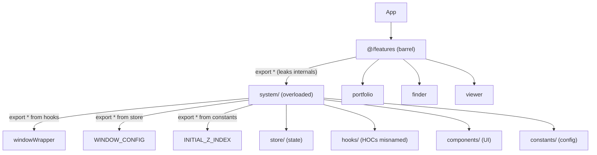
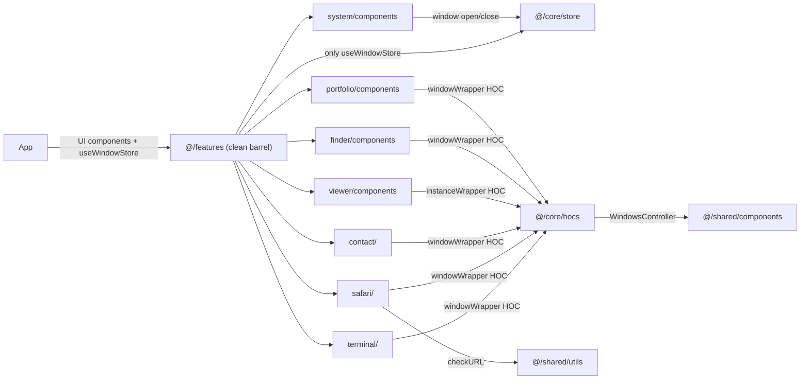

# Architecture Refactor Plan

## Current Structure Diagnosis




The `system` feature is the core problem — it bundles window management infrastructure, UI shell components, Zustand stores, and HOCs all under one roof. Its `export *` chain leaks internals like `windowWrapper`, `WINDOW_CONFIG`, and `INITIAL_Z_INDEX` all the way out to `@/features`.

---

## Issues Identified

**1. `system/` has too many responsibilities**

- Window management HOCs (`windowWrapper`, `instanceWrapper`) are infrastructure, not a feature
- `useWindowStore` / `useLocationStore` are app-level state, not "system UI"
- `Navbar`, `Dock`, `Welcome` are the actual UI — they're buried alongside store internals

**2. HOCs live in `hooks/`**

- `windowWrapper.jsx` and `instanceWrapper.jsx` are Higher-Order Components, not hooks
- Naming convention violation: hooks start with `use*`; HOCs don't

**3. `features/index.js` is a leaky barrel**

- `export * from "./system"` re-exports `windowWrapper`, `instanceWrapper`, `WINDOW_CONFIG`, `INITIAL_Z_INDEX`, `useLocationStore`, etc. — all internals that consumers of `@/features` should never touch
- Only public surface (UI components + the one needed store hook) should be exported

**4. `WindowsController` is shared infrastructure**

- Used by both `windowWrapper` and `instanceWrapper` HOCs
- Lives inside `system/components/` but serves the HOC layer, not the system UI

**5. Barrel proliferation for single files**

- `safari/utils/index.js` re-exports one function
- `finder/components/index.js` re-exports one component
- `viewer/index.js → components/index.js` is a two-hop barrel for two files
- Each extra barrel adds indirection with zero aggregation value

**6. `config/` vs `constants/` inconsistency**

- `terminal/` has only `config/` (no `constants/`)
- `portfolio/` and `finder/` have only `constants/` (no `config/`)
- `safari/` and `contact/` have both
- No enforced distinction between the two

**7. Backend dependencies in frontend `package.json`**

- `express`, `nodemailer`, `body-parser`, `cors` are server packages in the frontend manifest

---

## Proposed Structure

```
src/
├── main.jsx
├── App.jsx
├── styles/
│   └── index.css
│
├── core/                          ← NEW: window management infrastructure
│   ├── hocs/
│   │   ├── windowWrapper.jsx      ← moved from system/hooks/
│   │   └── instanceWrapper.jsx    ← moved from system/hooks/
│   ├── store/
│   │   ├── window.store.js        ← moved from system/store/
│   │   ├── location.store.js      ← moved from system/store/
│   │   └── index.js
│   └── constants/
│       ├── window.constants.js    ← moved from system/constants/
│       └── index.js
│
├── shared/                        ← NEW: truly reusable cross-feature code
│   ├── components/
│   │   └── WindowsController.jsx  ← moved from system/components/
│   └── utils/
│       └── url.js                 ← moved from safari/utils/
│
└── features/
    ├── system/                    ← TRIMMED: only macOS shell UI
    │   └── components/
    │       ├── Navbar.jsx
    │       ├── Dock.jsx
    │       └── Welcome.jsx
    ├── terminal/
    │   ├── index.jsx
    │   ├── components/
    │   ├── config/
    │   └── hooks/
    ├── safari/
    │   ├── index.jsx
    │   ├── components/
    │   ├── config/
    │   ├── constants/
    │   └── hooks/
    ├── finder/
    │   ├── index.jsx
    │   ├── components/
    │   └── constants/
    ├── contact/
    │   ├── index.jsx
    │   ├── components/
    │   ├── config/
    │   ├── constants/
    │   └── hooks/
    ├── portfolio/
    │   ├── components/
    │   └── constants/
    └── viewer/
        └── components/
            ├── TextViewer.jsx
            └── ImageViewer.jsx
```

---

## Key Changes Explained

### Extract `core/` layer

Move window management HOCs + stores + constants out of `system/` into a dedicated `core/` layer. `core/` is infrastructure — it has no UI, is consumed by HOCs and the store, and should never be imported directly from feature components.

**Before:** `import { windowWrapper } from "@/features/system/hooks"`
**After:** `import { windowWrapper } from "@/core/hocs"`

### Fix `features/index.js` — explicit public API only

```js
// Before (leaks everything)
export * from "./system";

// After (only the public UI surface)
export { Navbar, Welcome, Dock } from "./system/components";
export { useWindowStore } from "@/core/store";
export { default as Terminal } from "./terminal";
export { default as Safari } from "./safari";
export { default as Contact } from "./contact";
export { Skills, Resume } from "./portfolio/components";
export { Finder } from "./finder/components";
export { TextViewer, ImageViewer } from "./viewer/components";
```

### Move `WindowsController` to `shared/components/`

The `WindowsController` (traffic-light close/minimize/maximize buttons) is consumed by both HOCs inside `core/hocs/`. It is not a "system feature" — it is shared UI infrastructure.

### Move `url.js` to `shared/utils/`

URL validation is a generic utility. Keeping it in `safari/utils/` implies it belongs to Safari, but it could be used by any feature that opens URLs.

### Rename `system/hooks/` → remove (HOCs moved to `core/hocs/`)

The `hooks/` folder under `system` will be empty after moving the HOCs. Remove it.

### Consolidate `config/` vs `constants/`

Apply a clear rule:

- `**constants/**`: Static lookup values — string enums, icon maps, static data arrays (socials, gallery, tech stack)
- `**config/**`: Behavior-shaping configuration — form step definitions with validators, navigation trees, file system maps

Features that only have one type should use only that folder. The `terminal/` feature can rename its `config/` to `constants/` since `terminal.config.js` is really a static virtual file system definition.

### Remove single-file barrels

- `safari/utils/index.js` — import `url.js` directly after moving to `shared/utils/`
- `finder/components/index.js` — `Finder.jsx` is the only export; import directly
- `viewer/index.js` — collapse the two-hop `index → components/index` into one direct `components/index.js`

### Separate server code

Move `express`/`nodemailer` into a sibling `server/` directory with its own `package.json`. The frontend build should not include server packages.

---

## Import Flow After Refactor




---

## What Not to Change

- The `windowWrapper` / `instanceWrapper` HOC logic itself — it works well
- The Zustand + Immer store architecture — clean and correct
- The per-feature folder structure (`components/`, `hooks/`, `config/`) — sound
- GSAP animation patterns inside HOCs
- Tailwind CSS 4 styling approach (though splitting CSS per feature is a future improvement)

